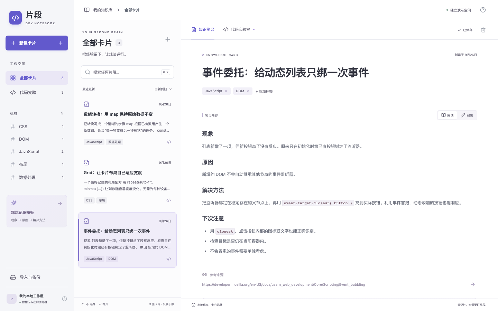
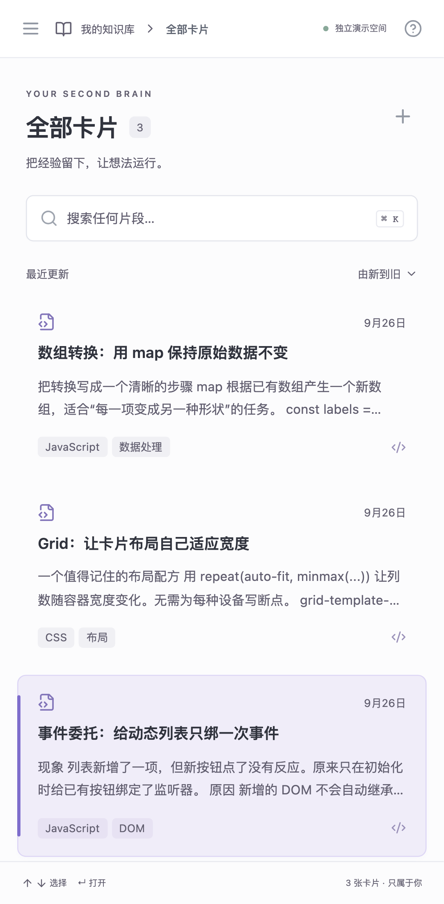
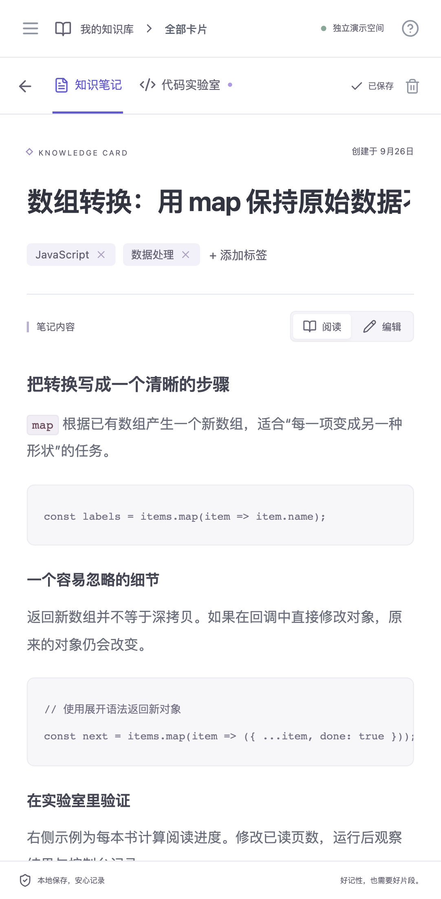

# 两分钟体验片段

先按 [README](./README.md) 启动开发服务，再打开 <http://127.0.0.1:5173/?demo=1>。演示空间与普通工作区使用不同的本地数据库；访客的数据只保存在访客自己的浏览器。

1. **0:00–0:30｜记录**：点“新建卡片”，写标题和 Markdown 正文，添加一个标签，等右上角显示“已保存”。刷新确认内容还在。
2. **0:30–0:55｜找回**：按 `⌘ / Ctrl + K`，输入正文里的词。可以继续选标签或搜索代码关键字。
3. **0:55–1:30｜验证**：打开“代码实验室”，在 HTML、CSS、JavaScript 标签中编辑；按 `⌘ / Ctrl + Enter` 主动运行，查看隔离预览和控制台。切换卡片不会自动运行代码。
4. **1:30–2:00｜带走**：从左侧“导入与备份”导出 JSON 或 ZIP。重新导入会先显示卡片数与重复 ID，可选择跳过或保留副本。

演示后，从右上角“使用帮助”选择“重置演示卡片”，可恢复三张示例。此操作只清除演示空间；需要保留的演示笔记请先导出。普通工作区不受影响。

| 桌面 | 手机列表 | 手机详情 |
| --- | --- | --- |
|  |  |  |

核心取舍：数据留在本机，避免账号与服务器依赖；预览只能运行原生浏览器代码，并通过不透明源 iframe 与宿主隔开；小备份保持兼容 JSON，大备份改用校验过的 ZIP。它不是恶意代码分析沙箱，也不提供云同步或永久存储保证。

当前仓库提供可运行源码和截图，尚未发布公开站点。公开预览需要另选部署地址，并再次检查服务端配置、来源链接及站点数据清理提示。
